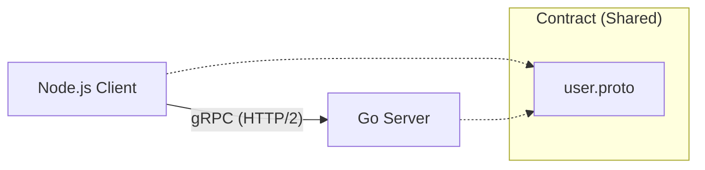
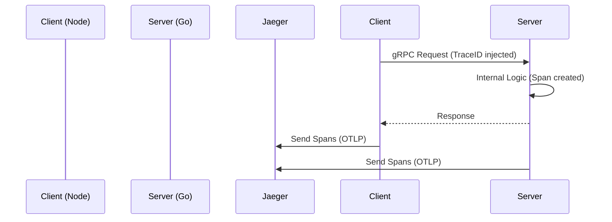

# 🚀 gRPC Learning Project: Go Server + Node.js Client

This project demonstrates **High-Performance Microservices Communication** using **gRPC** (Google Remote Procedure Call) and **Protocol Buffers**.

## 🧠 What You Will Learn
1.  **gRPC vs REST**: Why top tech companies prefer gRPC for internal services.
2.  **Protocol Buffers (.proto)**: How to define a strict contract between languages.
3.  **Polyglot Architecture**: Connecting a **Go** backend with a **Node.js** client.
4.  **Code Generation**: Automating the boilerplate code.

## 🏗 Architecture



-   **Transport**: HTTP/2 (Binary, Multiplexed)
-   **Serialization**: Protocol Buffers (Small, Typed, Fast)

## 📂 Project Structure
```
grpc-learning-project/
├── protos/           # The Single Source of Truth
│   └── user.proto     # Defines UserStruct, CreateUser(), GetUser()
├── server/           # High-Performance Backend (Go)
│   ├── main.go        # Implements the logic
│   ├── pb/            # Auto-generated Go code from proto
│   └── Dockerfile
├── client/           # Consumer (Node.js)
│   ├── client.js      # Loads proto and calls server
│   └── package.json
└── docker-compose.yml
```

## 🚀 How to Run

### Prerequisite
You need **Docker** and **Node.js** installed.

### 1. Start the Go Server
We run the server in a container to ensure a consistent environment.

```bash
docker-compose up --build
```
*You should see: `server listening at [::]:50051`*

### 2. Run the Node.js Client
Open a new terminal window.

```bash
cd client
npm install       # Install dependencies (only first time)
node client.js    # Run the client
```

### 3. Expected Output
The client will:
1.  Connect to the Go Server.
2.  Send a `CreateUser` request.
3.  Receive the generated ID.
4.  Send a `GetUser` request using that ID.

### 4. Viewing Traces (Observability)
We use **OpenTelemetry** and **Jaeger** to visualize the request flow.

1.  Open Jaeger UI: [http://localhost:16686](http://localhost:16686)
2.  Select Service: `node-client` or `go-server`.
3.  Click **Find Traces**.
4.  You will see the trace: `node-client` -> `go-server` -> `InternalLogic`.



### The Contract (`user.proto`)
This file defines exactly what data can be sent. It's like a strong Type interface that works across languages.

```protobuf
message CreateUserRequest {
  string name = 1;
  string email = 2;
  int32 age = 3;
}
```

### The Server (Go)
Uses the generated code (`pb/`) to enforce the interface. If you change the proto, the Go code won't compile until you implement the new methods!

### The Client (Node.js)
Uses `@grpc/proto-loader` to load the `.proto` file at runtime. This allows dynamic interactions without a compile step (common in Node.js).
